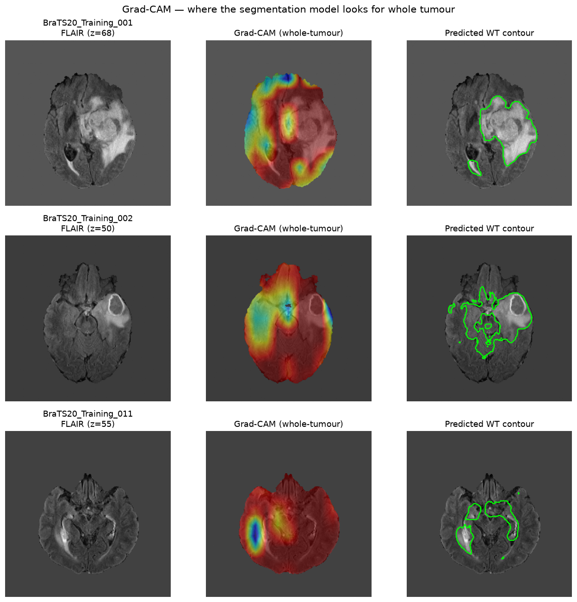

# Brain Tumour Segmentation & Survival Prediction from MRI

An end-to-end deep-learning pipeline for brain-tumour MRI: **3D segmentation →
tumour-feature extraction → survival stratification → explainability →
interactive demo**. Built with PyTorch and [MONAI](https://monai.io/).

The goal is a production-shaped, demonstrable clinical-imaging pipeline that
ingests raw NIfTI volumes, handles class imbalance correctly, and produces
interpretable, auditable output — not a notebook fit to a clean benchmark.

---

## What it does

| Stage | Method | Result |
|---|---|---|
| **Segmentation** | 3D U-Net + Dice Loss, 4-modality MRI → 3 overlapping tumour regions (TC/WT/ET) | mean Dice **0.71** (TC 0.70 · WT 0.71 · ET 0.73) |
| **Survival prediction** | Random Forest on tumour features + clinical covariates → 3-class survival | macro OVR-AUC **0.61** (end-to-end), 0.65 (expert masks); short-survivor AUC **0.70** |
| **Explainability** | Grad-CAM on the segmentation encoder | whole-tumour attention overlays |
| **Deployment** | Streamlit app | upload/select → segment → predict → explain |



---

## Architecture

```
 4-modality MRI (FLAIR, T1, T1ce, T2)  .nii
              │
              ▼
   ┌─────────────────────┐
   │  Preprocessing      │  RAS orient · 1mm resample · z-score norm  (data_pipeline.py)
   └─────────────────────┘
              │
              ▼
   ┌─────────────────────┐
   │  3D U-Net (MONAI)   │  Dice Loss (sigmoid), 3 overlapping regions  (train.py)
   └─────────────────────┘
              │  predicted TC / WT / ET masks
              ├───────────────► Grad-CAM explanation            (gradcam.py)
              ▼
   ┌─────────────────────┐
   │  Feature extraction │  volumes, ratios, shape + age/resection  (extract_features.py)
   └─────────────────────┘
              │
              ▼
   ┌─────────────────────┐
   │  Random Forest      │  3-class survival (short/mid/long)      (train_survival.py)
   └─────────────────────┘
              │
              ▼
        Streamlit demo   (app.py)
```

## Datasets

- **Segmentation** — [Medical Segmentation Decathlon, Task01_BrainTumour](http://medicaldecathlon.com/)
  (derived from BraTS 2016/2017; 484 labelled training volumes).
- **Survival** — [BraTS 2020](https://www.med.upenn.edu/cbica/brats2020/) (235 cases with
  overall-survival labels). The Decathlon volumes are deliberately re-anonymised and
  **cannot** be linked to survival labels, so BraTS 2020 is used for the survival stage.

Both are multi-modal MRI (FLAIR, T1w, T1gd/T1ce, T2w), skull-stripped and co-registered.

---

## Setup

```bash
python3 -m venv .venv
.venv/bin/pip install torch==2.11.0 --index-url https://download.pytorch.org/whl/cu128
.venv/bin/pip install -r requirements.txt
```

> **GPU note:** the `cu128` build is required to match a CUDA-12.8 (570-series) driver;
> the default PyPI `torch` wheel targets CUDA 13 and will report `cuda.is_available() == False`.

### Get the data

```bash
# Segmentation dataset (Decathlon Task01, ~7 GB) — HuggingFace mirror
.venv/bin/hf download Novel-BioMedAI/Medical_Segmentation_Decathlon \
    Task01_BrainTumour.tar --repo-type dataset --local-dir data/
tar -xf data/Task01_BrainTumour.tar -C data/

# Survival dataset (BraTS 2020, ~4.5 GB) — Kaggle mirror (needs kaggle.json)
.venv/bin/kaggle datasets download awsaf49/brats20-dataset-training-validation \
    -p data/brats2020 --unzip
```

---

## Usage

```bash
# 0. Explore the data first (recommended starting point)
.venv/bin/jupyter notebook eda.ipynb

# 1. Verify the data pipeline (saves a slice visualization)
.venv/bin/python verify_data.py

# 2. Train the segmentation U-Net (2× GPU, ~2 h for 50 epochs)
.venv/bin/python train.py --epochs 50 --cache-rate 0.3

# 3. Extract survival features (runs the U-Net over BraTS 2020)
.venv/bin/python extract_features.py

# 4. Evaluate the survival model (5-fold CV, saves plots)
.venv/bin/python train_survival.py
.venv/bin/python save_survival_model.py     # persist fitted model for the demo

# 5. Generate Grad-CAM explanations
.venv/bin/python gradcam.py

# 6. Launch the interactive demo
.venv/bin/streamlit run app.py
```

## Repository layout

| File | Purpose |
|---|---|
| `eda.ipynb` | **Exploratory data analysis** — image properties, intensity distributions, class imbalance, tumour sizes, survival relationships |
| `data_pipeline.py` | Transforms + DataLoaders; **custom Decathlon→BraTS label conversion** |
| `verify_data.py` | Phase 1 slice-visualization sanity check |
| `train.py` | 3D U-Net training (Dice Loss, AMP, DataParallel, W&B) |
| `extract_features.py` | Tumour-feature extraction from predicted + expert masks |
| `train_survival.py` | Survival classifier + CV evaluation + plots |
| `save_survival_model.py` | Persist the fitted survival model |
| `gradcam.py` | Grad-CAM explainability |
| `inference.py` | Shared inference helpers for the app |
| `app.py` | Streamlit demo |

## Results

See [`REPORT.md`](REPORT.md) for full methodology, results, and limitations
(including two honestly-documented engineering findings: a silent dataset
label-convention bug, and the known limitations of Grad-CAM on segmentation
networks).

## License / attribution

Datasets are © their respective providers (MSD, BraTS/CBICA) under their own
licenses. This code is provided for research and portfolio demonstration.
