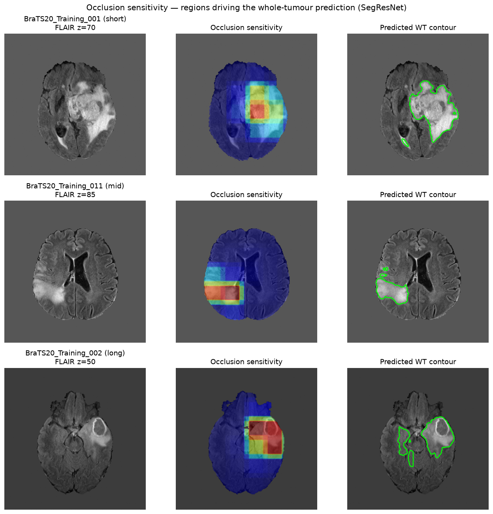

# Brain Tumour Segmentation & Survival Prediction from MRI

An end-to-end deep-learning pipeline that reads raw multi-modal brain MRI, segments
tumour sub-regions, predicts patient survival, and explains its reasoning — packaged
as an interactive demo. Built with **PyTorch** and **[MONAI](https://monai.io/)**.



---

## 1 · The Clinical Problem

Gliomas are among the most aggressive brain tumours, and MRI is central to diagnosing
them, planning treatment, and estimating prognosis. Two tasks consume significant
specialist time and carry real clinical weight:

- **Tumour delineation.** Radiologists manually outline the tumour and its sub-regions
  (enhancing tumour, necrotic core, surrounding edema) across dozens of 2D slices per
  patient — slow, labour-intensive, and subject to inter-rater variability. Consistent,
  automated, *quantitative* tumour measurement supports surgical planning and tracking
  response to therapy.
- **Prognosis.** Estimating a patient's likely survival window helps guide treatment
  intensity and patient counselling. Doing this from imaging + basic clinical data,
  reproducibly, is directly useful to a tumour board.

For a hospital, the value is **faster, more consistent tumour quantification** and a
**transparent, auditable** survival estimate a clinician can actually trust.

## 2 · The Technical Bottleneck

Medical imaging is *not* natural-image computer vision. What makes this hard:

- **3-D, multi-modal data.** Each case is a 240×240×155 volume across **four** MRI
  sequences (FLAIR, T1, T1ce, T2). Models must be 3D — memory- and compute-heavy —
  not 2D.
- **Severe class imbalance.** Tumour is only **~0.2–3 % of each volume** (measured in
  the EDA). A model trained with plain cross-entropy can score high accuracy by
  predicting "healthy" everywhere.
- **Interpretability bar.** Clinicians won't act on an unexplained output, so the
  pipeline must *show its work*.
- **Messy, real-world data.** Scanner-dependent intensity scales, differing label
  conventions between datasets, and the fact that the segmentation dataset has **no
  survival labels** at all — each a trap that silently corrupts results if unhandled.

## 3 · The Solution & Engineering Choices

| Decision | Why |
|---|---|
| **3D SegResNet** (MONAI) | Chosen over a U-Net baseline **on measured accuracy** (mean Dice 0.83 vs 0.71); residual encoder–decoder with deep supervision segments tumour sub-regions more accurately. |
| **Dice Loss** (not cross-entropy) | Directly optimises region overlap, which is robust to the severe foreground/background imbalance. |
| **Multi-label sigmoid** (3 overlapping regions) | TC/WT/ET are nested, not mutually exclusive — sigmoid + per-channel Dice models this correctly. |
| **Sliding-window inference** | Train on 128³ patches (fits VRAM), evaluate on full volumes without downsampling. |
| **AMP + DataParallel** | Mixed precision + 2× RTX 3090 to train efficiently. |
| **Survival: features → Random Forest, 3-class** | With only ~235 labelled cases, interpretable tumour features + a small model beats a data-hungry deep regressor; classification is more robust than noisy day-level regression. |
| **Occlusion sensitivity** (not Grad-CAM) | A *measurably* faithful, tumour-localising explanation for a segmentation net (see finding #3). |

**Three engineering findings worth highlighting** (full detail in [`REPORT.md`](REPORT.md)):

1. **A silent label-convention bug.** MONAI's built-in BraTS label transform assumes
   labels `1/2/4`, but the Decathlon dataset uses `1/2/3`. The mismatch produced an
   *all-empty enhancing-tumour channel* — caught by inspecting per-channel voxel counts.
   Fixing it lifted mean Dice **0.49 → 0.71** and enhancing-tumour Dice **0.0 → 0.73**.
2. **Architecture chosen by evidence.** A U-Net baseline (mean Dice 0.71) was benchmarked
   against SegResNet (0.83) on the same data/pipeline; SegResNet won on every region
   (WT 0.71 → 0.89), so it was adopted and the whole pipeline re-pointed to it.
3. **Explainability, measured — not assumed.** Grad-CAM was *quantified* and shown to
   fail on this segmentation net (localisation concentration 0.9×, 0% pointing game).
   It was replaced with **occlusion sensitivity**, which scores **6.2× concentration**
   and **50% pointing game** on the same benchmark — a working, validated explanation.

*Cross-dataset design:* segmentation is trained on the Medical Segmentation Decathlon
(Task01), and — because Decathlon deliberately breaks the link to patient outcomes —
survival is modelled on **BraTS 2020**, which ships imaging *and* survival labels.

## 4 · The Metrics That Matter

**Segmentation — clinical accuracy** (SegResNet; voxel-level, 30-volume validation
subset; full-validation mean Dice = **0.83**):

| Region | Dice | Sensitivity | Specificity |
|---|---|---|---|
| Tumour core (TC) | 0.86 | 0.87 | 0.999 |
| Whole tumour (WT) | **0.90** | **0.93** | 0.998 |
| Enhancing tumour (ET) | 0.85 | 0.83 | 1.000 |

High **sensitivity** means the model catches the large majority of true tumour voxels
(the clinically costly errors are missed tumour); specificity is near-perfect, aided by
the class imbalance.

**Segmentation — compute efficiency** (single full volume, sliding-window, AMP):

| Metric | Value |
|---|---|
| Inference latency | **1.0 s / volume** (median 0.97 s) |
| Peak VRAM (inference) | **5.9 GB** — runs on a single commodity GPU |
| Training | 100 epochs in ~3.5 h on 2× RTX 3090 |

**Explainability — occlusion sensitivity vs Grad-CAM** (localisation vs ground-truth
tumour, N=20; tumour is ~6% of the brain):

| Method | Concentration | Pointing game | Inside/outside |
|---|---|---|---|
| Grad-CAM | 0.9× (≈ random) | 0% | 0.9× |
| **Occlusion sensitivity** | **6.2×** | **50%** | **8.6×** |

**Survival — 3-class stratification** (stratified 5-fold CV, macro one-vs-rest AUC):

| Features | Accuracy | Macro AUC |
|---|---|---|
| Clinical only (baseline) | 0.41 | 0.56 |
| **+ imaging (end-to-end)** | 0.44 | **0.62** |
| + expert masks (upper bound) | 0.50 | 0.65 |

Imaging features add genuine prognostic signal over clinical data alone — and with the
better SegResNet masks the end-to-end AUC (0.62) nears the expert-mask upper bound
(0.65). The model is strongest on the clinically critical **short-survivor class
(AUC 0.67)**. Survival-from-imaging is a hard task: the best BraTS challenge entries reach
only ~0.62 *accuracy* (ceiling ~0.63). Our 3-class **accuracy** (0.44; 0.50 with expert
masks) beats random (0.33) and majority-guessing (0.38) but sits **below** those top
entries — the 0.62 above is AUC, a different metric. Honestly reported, not a SOTA claim.

---

## Architecture

```
 4-modality MRI (FLAIR, T1, T1ce, T2)  .nii
              │  preprocess: RAS · 1mm · z-score      (data_pipeline.py)
              ▼
   3D SegResNet + Dice Loss  ──► predicted TC / WT / ET masks  (train.py)
              │                         │
              │                         └─► occlusion-sensitivity explanation  (occlusion.py)
              ▼
   tumour features + age/resection      (extract_features.py)
              ▼
   Random Forest → 3-class survival      (train_survival.py)
              ▼
        Streamlit demo                   (app.py)
```

## Datasets

- **Segmentation** — [MSD Task01_BrainTumour](http://medicaldecathlon.com/) (484 labelled volumes).
- **Survival** — [BraTS 2020](https://www.med.upenn.edu/cbica/brats2020/) (235 cases with overall-survival labels).

Both are multi-modal MRI (FLAIR, T1w, T1gd/T1ce, T2w), skull-stripped and co-registered.

## Setup

```bash
python3 -m venv .venv
.venv/bin/pip install torch==2.11.0 --index-url https://download.pytorch.org/whl/cu128
.venv/bin/pip install -r requirements.txt
```
> **GPU note:** the `cu128` build matches a CUDA-12.8 (570-series) driver; the default
> PyPI `torch` wheel targets CUDA 13 and reports `cuda.is_available() == False`.

Data download commands are in the usage section below.

## Usage

```bash
# 0. Explore the data first (recommended starting point)
.venv/bin/jupyter notebook eda.ipynb          # or open eda.html

# segmentation dataset (Decathlon Task01, ~7 GB)
.venv/bin/hf download Novel-BioMedAI/Medical_Segmentation_Decathlon \
    Task01_BrainTumour.tar --repo-type dataset --local-dir data/ && tar -xf data/Task01_BrainTumour.tar -C data/
# survival dataset (BraTS 2020, ~4.5 GB)
.venv/bin/kaggle datasets download awsaf49/brats20-dataset-training-validation -p data/brats2020 --unzip

.venv/bin/python verify_data.py                               # 1. sanity-check the pipeline
.venv/bin/python train.py --arch segresnet --epochs 100 --cache-rate 0.3   # 2. train segmentation
.venv/bin/python extract_features.py          # 3. tumour features from BraTS (uses adopted model)
.venv/bin/python train_survival.py            # 4. survival CV + plots
.venv/bin/python save_survival_model.py       #    persist model for the demo
.venv/bin/python measure_gradcam.py           # 5. benchmark occlusion-sensitivity localisation
.venv/bin/streamlit run app.py                # 6. interactive demo (segment → predict → explain)
```

Remote server? See [`ACCESS.md`](ACCESS.md) for SSH-tunnel instructions.

## Repository layout

| File | Purpose |
|---|---|
| `eda.ipynb` | Exploratory data analysis (image properties, imbalance, survival relationships) |
| `data_pipeline.py` | Transforms + DataLoaders; custom Decathlon→BraTS label conversion |
| `verify_data.py` | Slice-visualization sanity check |
| `seg_model.py` | Model builder/loader (U-Net & SegResNet; arch read from checkpoint) |
| `train.py` | Segmentation training — `--arch {unet,segresnet}` (Dice Loss, AMP, DataParallel, W&B) |
| `extract_features.py` | Tumour-feature extraction from predicted + expert masks |
| `train_survival.py` / `save_survival_model.py` | Survival classifier: CV eval / persist model |
| `occlusion.py` / `gradcam.py` | Occlusion-sensitivity (adopted) / Grad-CAM (benchmarked, failed) |
| `measure_metrics.py` / `measure_gradcam.py` | Clinical+compute benchmark / XAI-localisation benchmark |
| `inference.py` / `app.py` | Shared inference helpers / Streamlit demo |

Full methodology, results, and limitations: **[`REPORT.md`](REPORT.md)**.

## License / attribution

Datasets are © their respective providers (MSD, BraTS/CBICA) under their own licenses.
Code provided for research and portfolio demonstration.
