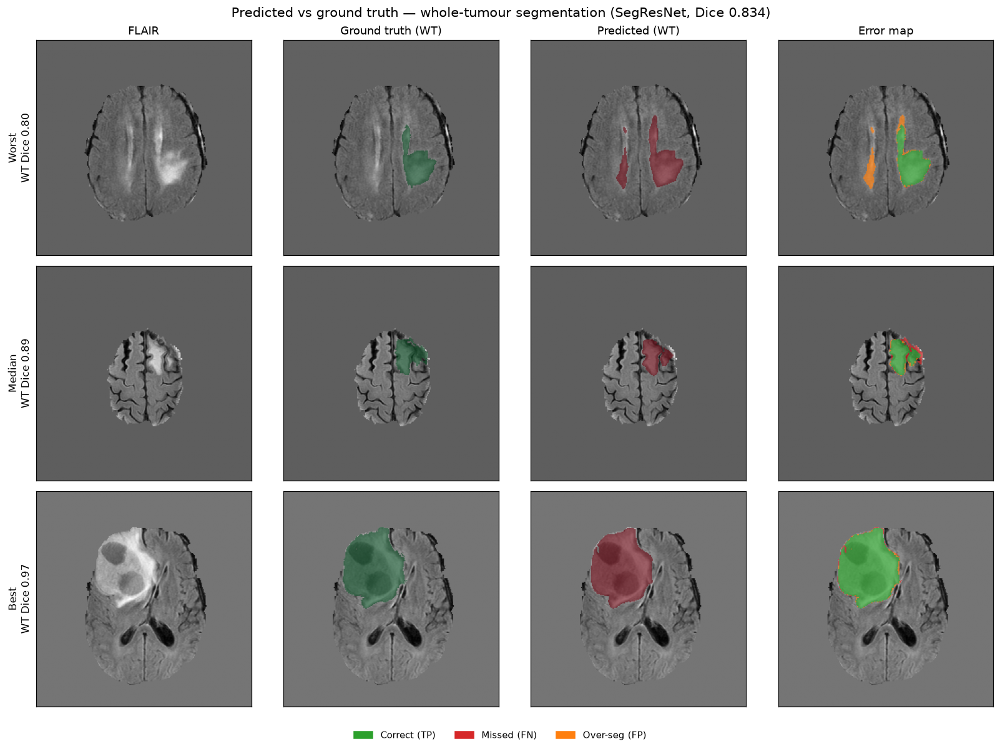
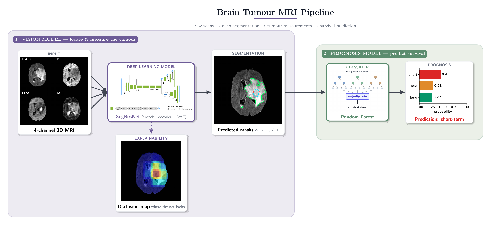

<h1 align="center">Brain tumour segmentation and survival prediction from MRI</h1>

<p align="center">
  This project combines brain tumour segmentation, feature extraction, and survival classification from multi-modal MRI. It uses a 3D SegResNet built with PyTorch and MONAI for segmentation, followed by a random forest classifier for survival prediction.
</p>

<p align="center">
  The Streamlit app lets you explore a case, view the predicted segmentation, and inspect occlusion maps alongside the survival prediction.
</p>

<p align="center">
  
</p>

<p align="center">
  
</p>

**Figure 1.** Segmentation results for the best, median, and worst validation cases by Dice score. Predicted contours are shown in red and reference contours in green. The error maps show correctly segmented tumour voxels in green, missed tumour in red, and over-segmentation in orange.

## Pipeline

The input consists of four MRI sequences: FLAIR, T1, T1ce, and T2.

1. A 3D SegResNet predicts whole-tumour, tumour-core, and enhancing-tumour masks.
2. The masks are used to calculate tumour volumes, shape features, and relative proportions of the tumour regions.
3. A random forest combines these features with age and surgery status to predict a short, medium, or long survival group.
4. Occlusion sensitivity maps show how the segmentation output changes when parts of the input are obscured.



**Figure 2.** MRI preprocessing, segmentation, feature extraction, and survival classification. [View the vector PDF](diagram/pipeline_diagram.pdf).

## Results

### Segmentation

On the held-out validation set:

| Region | Dice score |
|---|---:|
| Whole tumour | 0.90 |
| Tumour core | 0.86 |
| Enhancing tumour | 0.85 |

Sensitivity exceeded 0.83 for all three regions. Measured inference time was approximately one second per volume, with GPU memory usage around 6 GB.

### Survival classification

Adding tumour features to age and surgery status increased macro AUC from 0.56 to 0.62. The classifier performed best at identifying the short-survival group.

Three-class accuracy was 0.44 using predicted masks and 0.50 using reference masks. For comparison, uniform random guessing gives an expected accuracy of 0.33, and the majority-class baseline achieved 0.38.

These results suggest that the extracted features contain useful prognostic information, but survival classification remains a limitation of the pipeline.

See [REPORT.md](REPORT.md) for the full evaluation and limitations.

## Development notes

Several checks changed how I built and evaluated the pipeline.

### Fixing the segmentation labels

MONAI’s built-in BraTS label converter expects labels 1, 2, and 4. The Decathlon dataset uses 1, 2, and 3. This mismatch produced an empty enhancing-tumour target channel.

I found the issue after a 50-epoch training run by checking the voxel counts in each target channel. Correcting the label conversion increased mean Dice from 0.49 to 0.71.

### Comparing architectures

I compared U-Net and SegResNet under the same training setup. SegResNet performed better across all three tumour regions, increasing whole-tumour Dice from 0.71 to 0.89. I used it for the remaining experiments.

### Checking the explanation maps

The Grad-CAM maps looked plausible, but their highest-activation voxel fell inside the tumour in 0% of the evaluated cases.

I replaced Grad-CAM with occlusion sensitivity and evaluated it using the same spatial checks. Its highest-scoring voxel fell inside the tumour in roughly half the cases, and the maps concentrated on tumour regions about six times more than expected by chance.

## Setup and usage

The setup below uses a CUDA GPU and the PyTorch CUDA 12.8 build.

```bash
python3 -m venv .venv
.venv/bin/pip install torch==2.11.0 --index-url https://download.pytorch.org/whl/cu128
.venv/bin/pip install -r requirements.txt
```

### Download the datasets

The downloads are approximately 7 GB and 4.5 GB.

```bash
.venv/bin/hf download Novel-BioMedAI/Medical_Segmentation_Decathlon Task01_BrainTumour.tar \
    --repo-type dataset --local-dir data/

tar -xf data/Task01_BrainTumour.tar -C data/

.venv/bin/kaggle datasets download \
    awsaf49/brats20-dataset-training-validation \
    -p data/brats2020 --unzip
```

### Run the pipeline

Start with the exploration notebook, then train the segmentation model and survival classifier.

```bash
.venv/bin/jupyter notebook eda.ipynb

.venv/bin/python train.py --arch segresnet --epochs 100 --cache-rate 0.3

.venv/bin/python extract_features.py

.venv/bin/python train_survival.py
.venv/bin/python save_survival_model.py
```

Launch the app:

```bash
.venv/bin/streamlit run app.py
```

## Repository structure

| File | Purpose |
|---|---|
| `eda.ipynb` | Exploration of MRI sequences, class imbalance, and survival data |
| `data_pipeline.py` | Preprocessing, label conversion, and data loaders |
| `seg_model.py`, `train.py` | Segmentation architectures and training |
| `extract_features.py` | Extraction of tumour features from segmentation masks |
| `train_survival.py`, `save_survival_model.py` | Survival classifier training and export |
| `occlusion.py`, `gradcam.py` | Occlusion sensitivity and Grad-CAM implementations |
| `measure_metrics.py`, `measure_gradcam.py` | Segmentation and explanation-map evaluation |
| `inference.py`, `app.py` | Inference pipeline and Streamlit interface |

## Data

Segmentation training uses the [Medical Segmentation Decathlon](http://medicaldecathlon.com/) Task01 BrainTumour dataset. Survival classification uses [BraTS 2020](https://www.med.upenn.edu/cbica/brats2020/), which includes survival outcomes.

Both datasets contain skull-stripped, co-registered, multi-modal MRI scans. The datasets remain subject to their providers’ terms of use.
