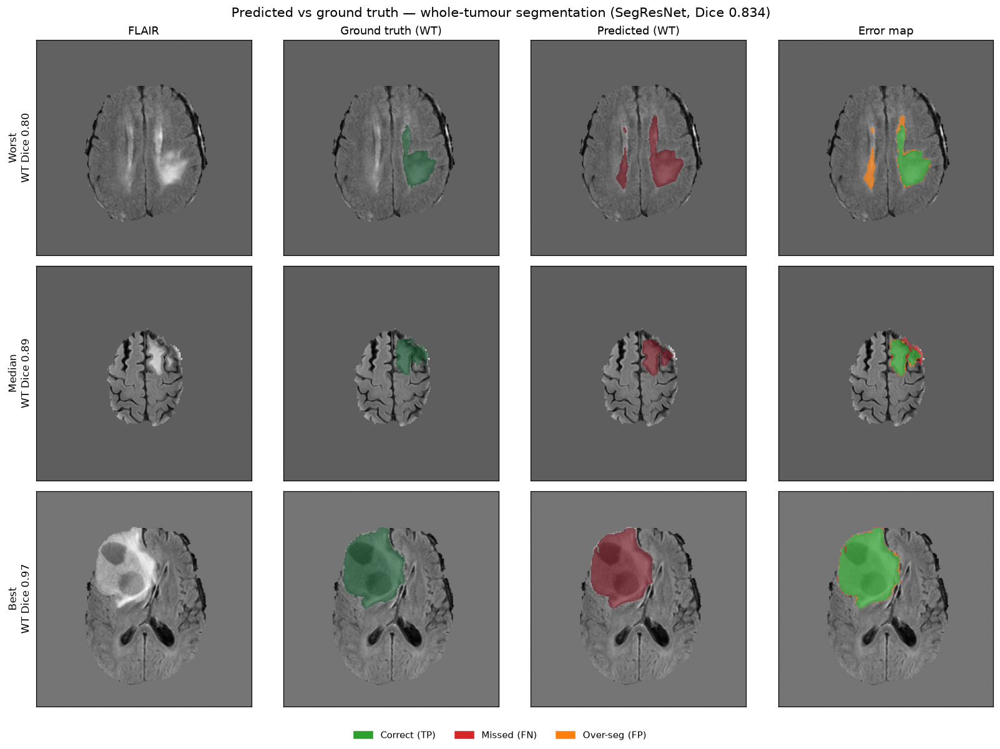
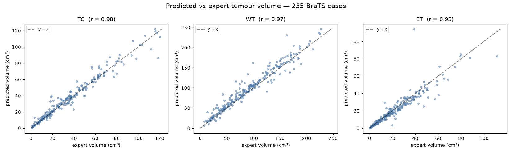

# Technical Report — Brain Tumour Segmentation & Survival Prediction

## 1. Introduction

Medical imaging data differs fundamentally from natural images: it is stored in
specialised 3D formats (NIfTI/DICOM), exhibits severe class imbalance (small
lesions in large volumes of healthy tissue), and carries a high bar for
interpretability because clinical decisions depend on the output. This project
builds an end-to-end pipeline that ingests raw multi-modal MRI, segments tumour
sub-regions, predicts a clinical outcome, and explains its predictions.

## 2. Data

| | Segmentation | Survival |
|---|---|---|
| Dataset | MSD Task01_BrainTumour | BraTS 2020 |
| Cases | 484 labelled | 235 with survival labels |
| Modalities | FLAIR, T1w, T1gd, T2w | FLAIR, T1, T1ce, T2 |
| Labels | edema / non-enhancing / enhancing | overall survival (days), age, resection |

The two datasets are the same MRI family, but the Decathlon release **deliberately
re-anonymised filenames to prevent linking cases back to BraTS**, so survival
labels cannot be joined onto the Decathlon volumes. BraTS 2020 (which ships imaging
*and* `survival_info.csv` under shared IDs) is therefore used for the survival stage.

## 3. Segmentation

**Preprocessing.** Load 4-modality NIfTI → channel-first → RAS orientation →
1 mm isotropic resampling → per-channel z-score normalisation over non-zero voxels.
Training uses random 128³ patches with flips and intensity jitter; validation uses
full volumes with sliding-window inference.

**Targets.** The 3 standard overlapping BraTS regions — TC (tumour core), WT (whole
tumour), ET (enhancing tumour) — trained as a **multi-label** problem with sigmoid
activation (the regions are nested, not mutually exclusive).

**Model selection.** Two architectures were trained on the identical data and
pipeline and compared on validation Dice:

| Architecture | Epochs | Mean Dice | TC | WT | ET |
|---|---|---|---|---|---|
| U-Net (baseline) | 50 | 0.713 | 0.699 | 0.714 | 0.732 |
| **SegResNet (adopted)** | 100 | **0.834** | 0.820 | **0.889** | 0.797 |

SegResNet (residual encoder–decoder, `init_filters=32`, dropout 0.2) won on every
region and was adopted; the downstream pipeline (feature extraction, survival model,
demo, explanations) was re-pointed to it. **Dice Loss** (sigmoid) directly optimises
overlap and handles the severe foreground/background imbalance that would defeat plain
cross-entropy. Trained with Adam + cosine LR, AMP, `DataParallel` across 2× RTX 3090.

**Result (adopted model).** Best validation **mean Dice 0.834**. On a 30-volume
voxel-level subset: WT Dice 0.90 / sensitivity 0.93, TC 0.86 / 0.87, ET 0.85 / 0.83;
specificity ≈ 0.999 throughout. Inference 1.0 s/volume at 5.9 GB peak VRAM.

### 3.1 Engineering finding — a silent label-convention bug

The first training run produced **ET Dice = 0.0000 for all 50 epochs** and WT capped
at 0.52. Root cause: MONAI's built-in `ConvertToMultiChannelBasedOnBratsClassesd`
assumes the *original* BraTS label convention (1 = core, 2 = edema, 4 = ET), but
Decathlon Task01 uses **1 = edema, 2 = non-enhancing, 3 = enhancing** — there is no
label 4. The transform therefore built an all-empty ET channel and a mislocated TC
channel, training the model against scrambled targets.

The fix was a custom `ConvertDecathlonBratsLabelsd` transform (TC = 2∨3, WT = 1∨2∨3,
ET = 3), verified by voxel counts and the nesting invariant WT ⊇ TC ⊇ ET. This lifted
mean Dice **0.488 → 0.713** and ET from **0.0 → 0.73**.
*Takeaway: always inspect `np.unique(labels)` and per-channel voxel counts before
trusting a dataset's label transform.*

### 3.2 Predicted vs ground truth

*Each row is one patient — the best, a typical (median), and the worst case by Dice
score. **Ground truth** (green) is the tumour region an expert radiologist outlined by
hand; **Predicted** (red) is what the model produced with no human input. The **error
map** compares them: green = correct, red = tumour the model missed, orange = tissue
the model wrongly flagged. A near-perfect result is almost all green (see "Best", Dice
0.97). Even the worst case (0.80) captures the tumour, with the main error being edge
over-segmentation.*

*Each dot is one of 235 patients. The horizontal axis is the tumour volume the expert
measured; the vertical axis is the volume the model measured. The dashed line is perfect
agreement — the tighter the dots hug it, the more accurately the model measures tumour
size. Correlations are high across all sub-regions (TC r=0.98, WT r=0.97, ET r=0.93),
confirming the model measures tumour burden — not just location — reliably, which is
what makes the downstream survival features trustworthy.*

## 4. Survival prediction

**Task.** 3-class overall survival, per the BraTS challenge convention:
short (<10 mo / <300 d), mid (10–15 mo / 300–450 d), long (>15 mo / >450 d).
Classes are reasonably balanced (89 / 59 / 86).

**Features.** The segmentation model (SegResNet) is run end-to-end on each BraTS case
to produce predicted masks, from which interpretable features are derived — per-region volumes
(TC/WT/ET, necrotic core, edema), ratios (enhancing fraction ET/WT, core fraction),
and whole-tumour shape (bounding-box extent, compactness) — plus clinical covariates
(age, resection status). Features are also computed from the **expert masks** as an
upper bound.

**Model.** Random Forest (balanced class weights), evaluated with stratified 5-fold
cross-validation. Metric: accuracy + **macro one-vs-rest ROC-AUC** (per the proposal).

**Results (full cohort, n = 234):**

| Feature set | Accuracy | Macro AUC |
|---|---|---|
| Clinical only (baseline) | 0.406 | 0.556 |
| Predicted masks (end-to-end, SegResNet) | 0.444 | **0.616** |
| Expert masks (upper bound) | 0.500 | **0.650** |

Imaging features add real prognostic signal over the clinical baseline, and the
ordering *clinical < predicted < expert* quantifies how segmentation quality
propagates downstream — with SegResNet's better masks the end-to-end AUC (0.616) rose
toward the expert-mask ceiling (0.650). Per-class ROC shows the model is strongest on the clinically
critical **short-survivor class (AUC 0.67)**; the mid class sits near chance
(AUC 0.55) — a well-documented difficulty in BraTS survival work. Top features are
age, whole-tumour shape, and enhancement ratios — all clinically plausible.

**Context, stated precisely.** Survival-from-imaging is genuinely hard: the BraTS
challenge scores it by *accuracy*, and the best entries reach only ~0.62 (the 2020
winner: 61.7%; the all-time ceiling ~0.63). Our 3-class **accuracy** is **0.44**
(0.50 with expert masks) — above random (0.33) and majority-guessing (~0.38), but
**below** the top challenge entries, not matching them. The **0.62 figure above is
AUC** (a ranking metric), which is *not* comparable to the challenge's accuracy despite
sharing the digits. The value here is a well-characterised, honestly-reported result
with a clear baseline → imaging → upper-bound story — not a claim of state-of-the-art.

## 5. Explainability — measured, not assumed

Rather than present a heatmap and assume it is meaningful, explanation quality was
**quantified** against ground-truth tumour masks (N=20) with three localisation
metrics: *concentration* (heat energy inside tumour ÷ tumour volume fraction; >1 beats
random), *pointing game* (does the hottest voxel fall in the tumour?), and
*inside/outside* (mean heat inside vs outside tumour).

| Method | Concentration | Pointing game | Inside/outside |
|---|---|---|---|
| **Grad-CAM** | 0.9× | 0% | 0.9× |
| **Occlusion sensitivity** | **6.2×** | **50%** | **8.6×** |

**Grad-CAM fails on this task.** Designed for classification CNNs, it produces diffuse
maps on a segmentation network (a per-voxel, context-driven decision); its
concentration of 0.9× is *worse than random* and its peak never lands in the tumour.
**Occlusion sensitivity** — mask a region, measure the drop in predicted tumour mass —
is perturbation-based and suited to segmentation: it concentrates 6.2× on the tumour
and its peak lands inside half the time (the tumour is only ~6% of the brain). It is
the adopted explanation method; the Grad-CAM analysis is retained as a documented
negative result. For speed the perturbation loop runs on a 2× downsampled volume
(~8 s/case) and the map is upsampled back.

## 6. Deployment

A Streamlit app (`app.py`) exposes the full pipeline: select a bundled sample case or
upload four modalities → segmentation overlay with a slice slider → survival class and
probabilities (with ground-truth comparison for samples) → occlusion-sensitivity
overlay → tumour volume metrics.

## 7. Limitations & future work

- **Segmentation** is trained on Decathlon and applied to BraTS 2020 (a domain shift).
  Adopting SegResNet already lifted WT Dice to 0.89; fine-tuning directly on BraTS or
  larger patches could close the residual gap further.
- **Survival** has small N (235; ~118 GTR-only) and modest AUC, consistent with the
  literature. Deep encoder features, radiomics, or a survival-analysis model (Cox /
  time-to-event) are natural next steps.
- **Explainability** now uses occlusion sensitivity (validated at 6.2× concentration).
  SHAP on the survival features would extend interpretability to the prognosis stage
  (feature importances are already reported).

## 8. Reproducibility

All stages are scripted and seeded where applicable; see `README.md` for exact
commands. Environment pinned in `requirements.txt`; segmentation training tracked in
Weights & Biases.
