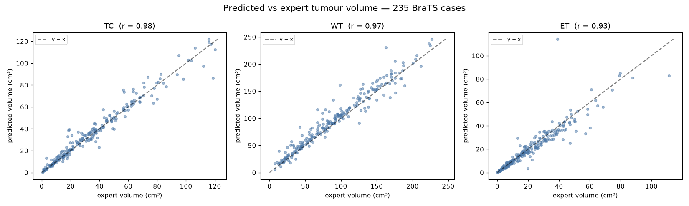

# Technical report

This report describes the data, methods, and evaluation behind the project. See the [README](README.md) for an overview and setup instructions.

## Data

The project uses two datasets containing skull-stripped, co-registered MRI scans with four modalities: FLAIR, T1, T1ce, and T2.

- **Segmentation:** Medical Segmentation Decathlon Task01, with 484 labelled volumes.
- **Survival classification:** BraTS 2020, with 235 cases containing survival labels.

The Decathlon filenames do not provide a direct mapping to BraTS case identifiers. Survival classification therefore uses the BraTS 2020 data and its accompanying clinical information and outcome labels.

## Segmentation

### Preprocessing and training

The four MRI modalities are loaded from NIfTI files, reoriented to RAS, and resampled to 1 mm voxel spacing. Each modality is standardized using the mean and standard deviation of its non-zero voxels.

Training uses random 128 × 128 × 128 patches, with flips and intensity jitter for augmentation. Validation uses full volumes with sliding-window inference.

The model predicts three overlapping tumour regions:

- **Whole tumour (WT)**
- **Tumour core (TC)**
- **Enhancing tumour (ET)**

Because a voxel can belong to more than one region, training uses sigmoid outputs and Dice loss rather than a softmax over mutually exclusive classes.

### Architecture comparison

I trained U-Net and SegResNet using the same data and preprocessing pipeline. The runs differed in training duration, so the results compare the two training configurations rather than isolating the effect of architecture.

| Architecture | Epochs | Mean Dice | TC | WT | ET |
|---|---:|---:|---:|---:|---:|
| U-Net | 50 | 0.713 | 0.699 | 0.714 | 0.732 |
| **SegResNet** | 100 | **0.834** | **0.820** | **0.889** | **0.797** |

SegResNet achieved higher Dice scores across all three regions and was used for feature extraction and inference.

Training used Adam, a cosine learning-rate schedule, and mixed precision on two RTX 3090 GPUs.

A separate evaluation on a 30-volume validation subset gave the following results:

| Region | Dice |
|---|---:|
| Whole tumour | 0.90 |
| Tumour core | 0.86 |
| Enhancing tumour | 0.85 |

Whole-tumour sensitivity was 0.93, and specificity was approximately 0.999. Specificity should be interpreted alongside Dice and sensitivity because most voxels are background.

Measured segmentation inference time was approximately one second per volume, with GPU memory usage of 5.9 GB.

### Correcting the label conversion

The first training run produced an enhancing-tumour Dice score of 0.0 throughout all 50 epochs.

Checking the voxel counts in each target channel revealed a label mismatch. MONAI’s built-in BraTS converter expects labels 1, 2, and 4, whereas the Decathlon dataset uses labels 1, 2, and 3. The converter therefore produced an empty enhancing-tumour channel and an incorrect tumour-core mask.

I replaced it with a converter using the Decathlon labels:

- Tumour core: labels 2 and 3
- Whole tumour: labels 1, 2, and 3
- Enhancing tumour: label 3

After correcting the targets and retraining, mean Dice increased from 0.49 to 0.71. This issue highlighted the need to inspect label values and transformed masks before starting a full training run.

### Predicted and reference segmentations

*Best, median, and worst evaluated cases by Dice score. Reference contours are green and predicted contours are red. The error maps show correctly segmented tumour voxels in green, missed tumour in red, and over-segmentation in orange. The lowest-scoring case shown had a Dice score of 0.80.*

*Predicted and reference tumour volumes, with one point per patient. The diagonal represents exact agreement.*

Volume correlations were 0.98 for tumour core, 0.97 for whole tumour, and 0.93 for enhancing tumour. These results show a strong association between predicted and reference volumes, although correlation alone does not establish agreement or rule out systematic measurement bias.

## Survival classification

Survival is treated as a three-class classification problem using the BraTS cutoffs:

- **Short:** less than 10 months
- **Medium:** 10–15 months
- **Long:** more than 15 months

The recorded class counts are 89, 59, and 86, respectively. These total 234 cases; the difference from the 235 cases listed above needs to be reconciled.

### Features and evaluation

For each case, the segmentation model produces masks used to calculate regional volumes, volume ratios such as the enhancing-tumour fraction, and whole-tumour shape features. These are combined with age and resection status.

A random forest predicts the survival group. Performance is evaluated using stratified five-fold cross-validation.

Three feature sets are compared:

1. Clinical variables only
2. Clinical variables and features from predicted masks
3. Clinical variables and features from reference masks

The reference-mask experiment assesses how the classifier performs when segmentation errors are removed. It is a comparison point rather than a strict upper bound.

| Features | Accuracy | Macro AUC |
|---|---:|---:|
| Clinical only | 0.41 | 0.56 |
| Clinical + predicted-mask features | 0.44 | **0.62** |
| Clinical + reference-mask features | 0.50 | 0.65 |

Adding predicted tumour features increased macro AUC from 0.56 to 0.62 and accuracy from 0.41 to 0.44. Reference-mask features gave the highest scores.

The predicted-mask model performed best for the short-survival group, with an AUC of 0.67. Performance for the medium-survival group was closer to chance, with an AUC of 0.55.

These results suggest that the imaging features provide additional information beyond age and resection status. However, the improvement is modest, and uncertainty around the cross-validation estimates would be needed to assess its reliability.

Accuracy and AUC describe different aspects of performance. The reported macro AUC of 0.62 should not be interpreted as 62% classification accuracy or directly compared with challenge results reported using accuracy. Comparisons also require compatible cohorts and evaluation procedures.

## Explainability

I evaluated explanation maps against reference tumour masks rather than relying on their appearance.

The evaluation used 20 cases and three localization measures:

- **Concentration:** the proportion of heat inside the tumour, normalized by the tumour’s proportion of the volume. Values above 1 indicate greater concentration than a uniform map.
- **Pointing game:** whether the highest-scoring voxel falls inside the tumour.
- **Inside/outside ratio:** the ratio of mean heat inside the tumour to mean heat outside it.

| Method | Concentration | Pointing game | Inside/outside |
|---|---:|---:|---:|
| Grad-CAM | 0.9× | 0% | 0.9× |
| **Occlusion sensitivity** | **6.2×** | **50%** | **8.6×** |

In this evaluation, the Grad-CAM implementation produced diffuse maps with poor tumour localization. The highest-scoring voxel did not fall inside the tumour in any of the 20 cases.

Occlusion sensitivity gave better localization. It obscures patches of the input and measures the resulting change in the tumour prediction. Its maps were 6.2 times more concentrated within tumour regions than a uniform map, and their highest-scoring voxel fell inside the tumour in half the cases.

These findings supported using occlusion sensitivity in the app. They apply to the implementations and cases evaluated here; they do not establish that Grad-CAM is unsuitable for segmentation in general.

The Grad-CAM implementation and evaluation remain in the repository as a documented negative result. To reduce computation time, occlusion runs on a volume downsampled by a factor of two, taking approximately eight seconds per case.

These maps explain changes in the segmentation output. They do not explain the random forest’s survival predictions.

## Application

The Streamlit app in `app.py` brings the pipeline into a single interface. Users can select a case or upload the four MRI modalities, then:

- View the predicted tumour segmentation
- Inspect tumour volumes
- See the predicted survival group and class probabilities
- Explore occlusion sensitivity overlays
- Scroll through MRI slices

The survival probabilities are model outputs and have not been established as calibrated clinical risk estimates.

## Limitations and further work

### Segmentation transfer

The segmentation model is trained on Decathlon and applied to BraTS 2020. Differences between the datasets may affect performance. Evaluation against BraTS reference masks is needed to characterize this transfer, and fine-tuning could be tested as a subsequent experiment.

Because the datasets have related origins, possible case overlap should also be checked before interpreting BraTS performance as independent external validation.

### Survival sample size and evaluation

The survival cohort is small, and classification performance is modest. Cross-validation provides an internal evaluation, but an independent cohort would be needed to assess generalization.

Confidence intervals and calibration analysis would help characterize the uncertainty and usefulness of the predictions.

### Survival modelling

The current model predicts broad survival groups rather than time to an event. A time-to-event model could be explored if follow-up and censoring information are available. Additional radiomic features could also be evaluated.

### Explanation of survival predictions

The current explanation maps concern segmentation. Feature-level analysis, such as SHAP, could help examine how tumour measurements and clinical variables contribute to the survival classifier’s output.

## Reproducibility

The [README](README.md) contains the commands for data preparation, training, feature extraction, and running the app.

Dependencies are pinned in `requirements.txt`, random seeds are set in the relevant scripts, and segmentation training is logged to Weights & Biases. Exact reproducibility may still depend on the hardware and CUDA environment.
